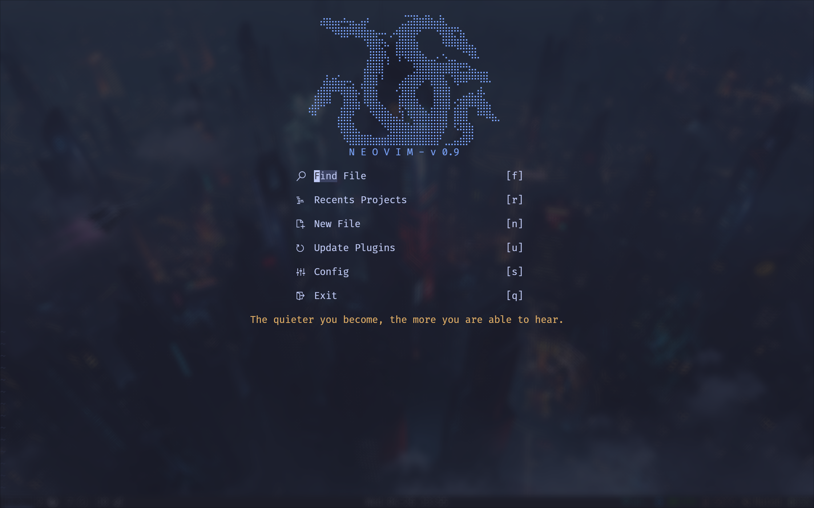
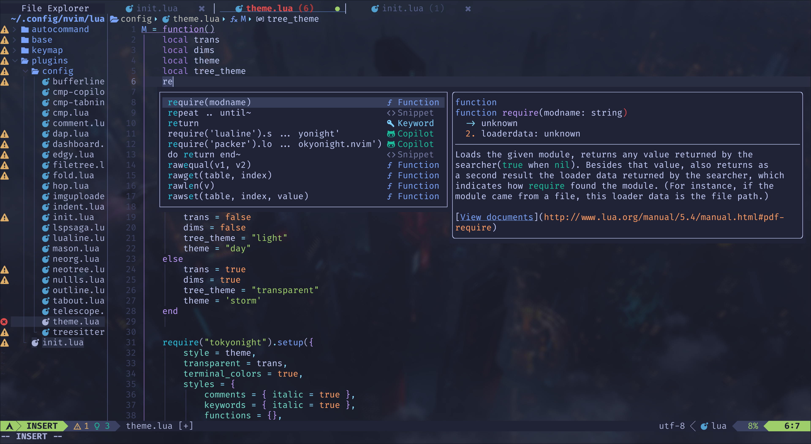
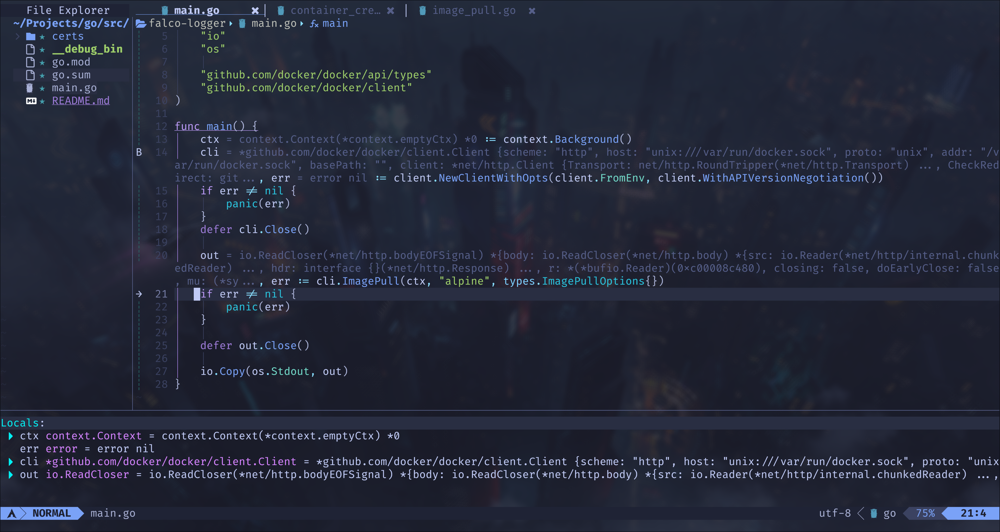

# Neovim Configuration

<!--toc:start-->

- [Neovim Configuration](#neovim-configuration)
  - [Introduction](#introduction)
  - [Plugin](#plugin)
  - [File Structure](#file-structure)
  - [Todo](#todo)
  <!--toc:end-->






## Introduction

This repo contains my neovim Configuration, including some popular plugins and my customization about keybindings, autocommand, and so on.

## Plugin

|   plugin type   |             plugin name             |
| :-------------: | :---------------------------------: |
| package manager |              lazy.nvim              |
|      theme      |        folke/tokyonight.nvim        |
|  code comment   |        numToStr/Comment.nvim        |
|  code comment   |      folke/todo-comments.nvim       |
|  brackets pair  |        windwp/nvim-autopairs        |
|    dashboard    |       glepnir/dashboard-nvim        |
|  fuzzy finder   |    nvim-telescope/telescope.nvim    |
|   status bar    |       akinsho/bufferline.nvim       |
|   code indent   | lukas-reineke/indent-blankline.nvim |
| highlight word  |        RRethy/vim-illuminate        |
|     tab bar     |        hoob3rt/lualine.nvim         |
|    filetree     |      kyazdani42/nvim-tree.lua       |
| symbol outline  |        stevearc/aerial.nvim         |
| code highlight  |   nvim-treesitter/nvim-treesitter   |
|   lsp manager   |       williamboman/mason.nvim       |
| code completion |          hrsh7th/nvim-cmp           |
|    AI coding    |       zbirenbaum/copilot.lua        |
|  code snippet   |          L3MON4D3/LuaSnip           |
|    code fold    |        kevinhwang91/nvim-ufo        |
|  code debugger  |        mfussenegger/nvim-dap        |
| lsp enhancement |        glepnir/lspsaga.nvim         |
|   git status    |       lewis6991/gitsigns.nvim       |
|    movement     |          phaazon/hop.nvim           |
|    zen mode     |         folke/zen-mode.nvim         |
| session restore |       folke/persistence.nvim        |
|   lsp status    |          j-hui/fidget.nvim          |

## File Structure

```
├── ftplugin <-- customization for different filetype
├── lua
│   ├── autocommand <-- autocommand
│   ├── base <-- basic neovim options
│   ├── keymap <-- keymap for almost all part
│   └── plugins
│       └── config <-- plugin configurations
├── queries
│   └── markdown <-- custom markdown parser for better expierence
└── snippets <-- custom code snippets
```

## Install

```bash
git clone https://github.com/ch3n9w/neovim
cd neovim
mv ~/.config/nvim ~/.config/nvimbak
cp -r nvim ~/.config/
```

## Todo

- [ ] add keymap table
- [ ] add autocommand table
